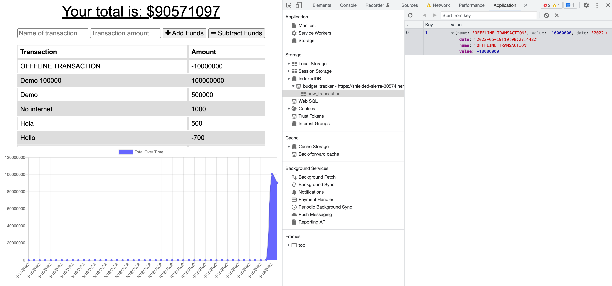

# Budget Tracker v2.0 :turtle::moneybag:

#### This is a budget tracker application that allows both online and offline access/functionality. Users can add expenses and deposits to their budget with or without an Internet connection. When the user enters transactions offline, the total is updated when they come back online.

## To use this Application

- Navigate to Link below
- Input transactions
- Test offline functionality by toggling Network in Chrome DevTools to Offline

[App URL](https://shielded-sierra-30574.herokuapp.com/)

### User Story
```
AS AN avid traveler
I WANT to be able to track my withdrawals and deposits with or without a data/internet connection
SO THAT my account balance is accurate when I am traveling 
```

### Acceptance Criteria
```
GIVEN a budget tracker without an internet connection
WHEN the user inputs an expense or deposit
THEN they will receive a notification that they have added an expense or deposit
WHEN the user reestablishes an internet connection
THEN the deposits or expenses added while they were offline are added to their transaction history and their totals are updated
```

### Screenshots

### Landing Page


### Online Transaction


### Offline Transaction



### Offline transasctions sycned to MongoDB Atlas after App comes back online


### Mobile (PWA) App

